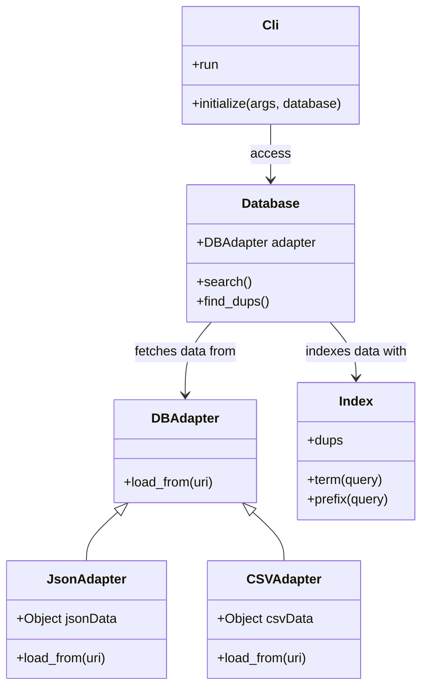

# About

This application supports simple operations over a client database.

# Requirements

* Ruby 3.x

# Setup

`bundle install`

# Usage

* Find client by name:

```
./bin/shift-exec search Alex
Searching for: Alex
Found: {"id"=>3, "full_name"=>"Alex Johnson", "email"=>"alex.johnson@hotmail.com"}
```

* Find duplicate emails
```
./bin/shift-exec find_dups
Finding duplicates...
Duplicate found: jane.smith@yahoo.com
```

# Testing

To test, run the rspec testing suite:

```
bundle exec rspec
```

# Design

The design relies on 4 classes:
* `Cli`: parses the command line and executes the commands
* `Database`: provides an interface to load the "tables" and index fields.
* `Index`: Provides a simple interface to create indexes on data arrays.
* `JsonAdapter`: An adapter to load data from JSON.

The relationship between the classes can be seen below:



## Extensibility

* New data sources:
  New data sources can be added by creating new adapters. For example creating a `CSVAdapter` class.
* New queries:
  The `Cli` class can easily be extended to support new fields and queries.
  Indexing new fields can be done by adding `#create_index` call into the `shift-exec` binary.
* API/Web support
  This library can be incorporate inside a Ruby On Rails, Sinatra or similar application.

## Assumptions and Caveats

* The database (json) file is read only and we're not expecting any write operations.
  Allowing to make changes like deleting and updating would required different data structures.
* The fields in the json are expect to have consistant type and mismatches are not validated.
* "Partial matching" in the problem description is loosely defined. I'm assuming here a simple prefix search
  since that's easier to implement. Extending it to support partial substring matching would require different index
  structures using proper information retrieval algorithms like permuterm or k-gram indexes. Those would be better suited
  for a full text search database.

